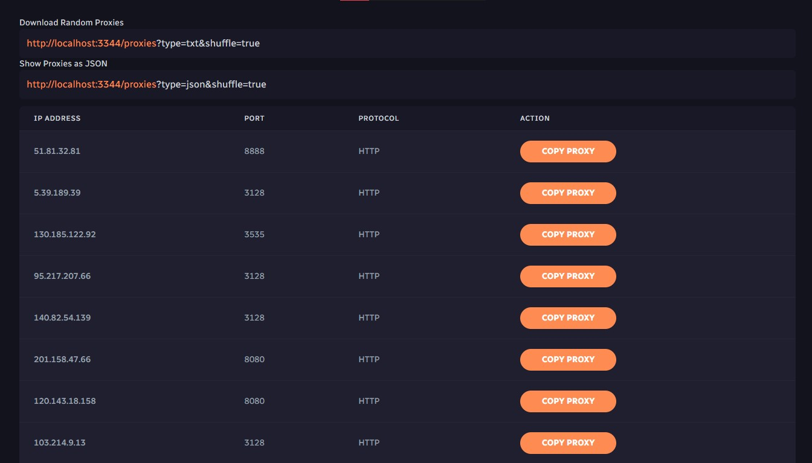

# Proxi

A Node.js app that automaticaly finds and checks proxies for you and shows them on a dashboard.



## Install & Setup

```shell
## Download
git clone https://github.com/jareer12/Proxi.git
cd Proxi
## Modules
npm install
## Create File
touch ./Data/working.txt
```

Create a `.env` files and configure it to your liking. Here is an example.

```env
## Settings
API_ACCESS=true

## Intervals & Cron Timers
RESET_INTERVAL_MS=600000
RUN_CRON_INTERVAL_MS=60000
DEFAULT_CHECKER_TIMEOUT_MS=5000

## Limits
MAX_LIMIT_PER_ARCHIVE_CHECK=250
```
